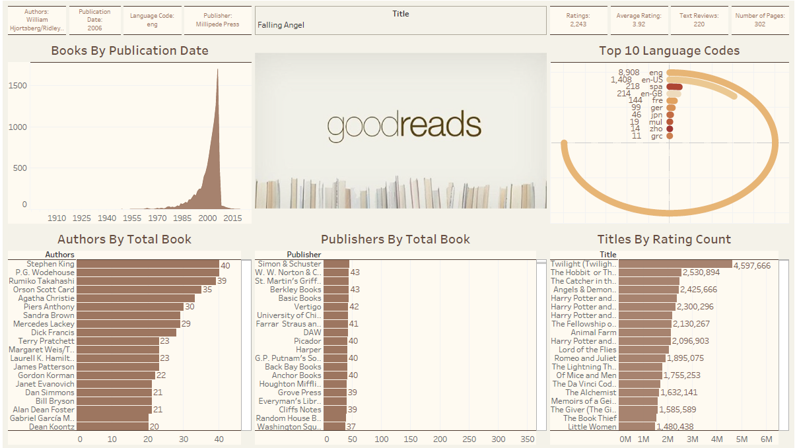

# Goodreads Dashboard using Tableau
This project is a data visualization and analysis initiative aimed at harnessing the power of Tableau to provide a comprehensive and interactive visualization of Goodreads data. Goodreads is a popular platform for book lovers to discover, review, and track their reading lists.

# Data Source
The data souce is an excel file. The dataset used in this analysis is the publicly available Goodreads-books dataset. (https://www.kaggle.com/datasets/jealousleopard/goodreadsbooks)

# Final Dashboard

